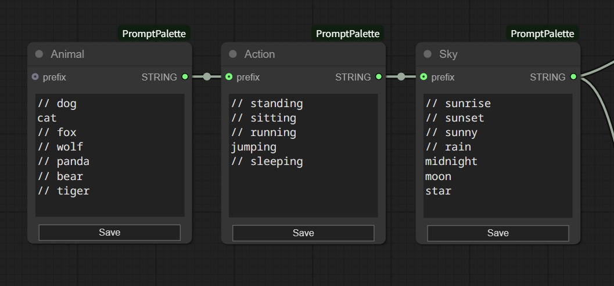

# ComfyUI PromptPalette

A custom node for ComfyUI that makes prompt editing easier by allowing phrase switching with just mouse operations

## Features

- Toggle phrases by turning checkboxes on and off
- Output phrases as comma-separated text
- Combine with input text

## Installation

1. Clone into the `custom_nodes` directory of ComfyUI
2. Restart ComfyUI

## Usage

1. Add the `Prompt Palette` node to your workflow
2. Edit text:
   - Click the Edit button to switch to edit mode
   - Enter one phrase per line
     
   - Click the Save button to complete editing
3. Toggle phrases:
   - Toggle checkboxes in display mode to select which phrases to use
