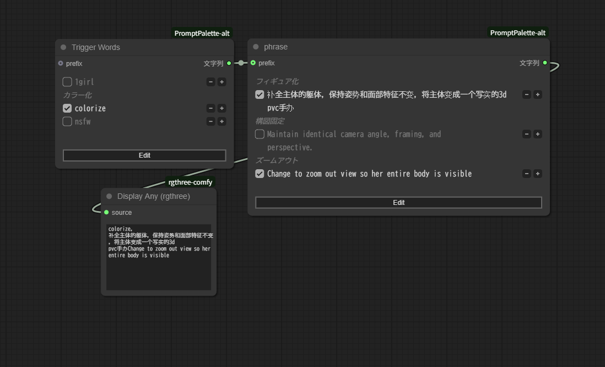

# ComfyUI PromptPalette-F

トリガーワードやフレーズのメモをトグルでオン・オフできるComfyUI用カスタムノード

## 機能

- **フレーズの切り替え** - チェックボックスでのON/OFF切り替え
- **フレーズの重み調整** - +/-ボタンでの重み調整 （※最初の単語のみ）
- **カスタム区切り文字** - 結合するための区切り文字設定（デフォルト：カンマ+スペース）
- **出力** - カスタム区切り文字で連結されたテキスト

## インストール

1. ComfyUIの `custom_nodes` ディレクトリにクローン
2. ComfyUIを再起動

## 使い方

1. **ノードを追加**: `PromptPalette-F` ノードをワークフローに追加
2. **テキスト編集**:
   - **Edit**ボタンをクリックして編集モードに切り替え
   - 1行に1つのフレーズを入力
   - **Save**ボタンをクリックして編集を完了
3. **フレーズ制御**:
   - 表示モードで**チェックボックス**を切り替えてフレーズを有効/無効化
   - **+/-ボタン**でフレーズの重みを調整
4. **カスタム区切り文字の設定**（オプション）:
   - separatorフィールドでフレーズを結合する区切り文字を設定（デフォルト：`, `）
   - 区切り文字なし/間隔なしの場合は空文字列を使用
5. **説明コメントの追加**（オプション）:
   - `#` で始まる行を追加して説明コメントを記述
   - コメントは次のフレーズの上に説明テキストとして表示
6. **出力**:
   - 選択されたフレーズが設定された区切り文字で出力される

## 高度な使い方

### コメントの種類

- **切り替えコメント（`//`）**: `//` で始まる行はチェックボックスがOFFの状態がデフォルトになる

### 設定項目
- **text** - メインの入力テキスト（1行に1フレーズ）
- **prefix** - テキストの前に置く文字列（複数ノード連結用）
- **separator** - フレーズを結合する際の区切り文字（デフォルト：`, `）
- **trailing_separator** - 最後のフレーズの後にも区切り文字を追加
- **separator_newline** - 各区切り文字の後に改行を追加
- **add_newline** - 最終出力の末尾に改行を追加

---

# ComfyUI PromptPalette-F

A custom node for ComfyUI that makes prompt editing easier by allowing phrase switching with just mouse operations

## Features

- **Toggle phrases** with checkboxes
- **Adjust phrase weights** using +/- buttons
- **Prefix input** to combine with generated text
- **Custom separator** for joining phrases (default: comma + space)
- **Output** as properly formatted text with custom separators

## Installation

1. Clone into the `custom_nodes` directory of ComfyUI
2. Restart ComfyUI

## Usage

1. **Add the node**: Add the `PromptPalette-F` node to your workflow
2. **Edit text**:
   - Click the **Edit** button to switch to edit mode
   - Enter one phrase per line
   - Click the **Save** button to complete editing
3. **Control phrases**:
   - **Toggle checkboxes** in display mode to enable/disable phrases
   - **Adjust phrase weights** using +/- buttons
4. **Set custom separator** (optional):
   - Configure the separator field to join phrases (default: `, `)
   - Use empty string for no separator/spacing
5. **Add description comments** (optional):
   - Start lines with `#` to add descriptive comments
   - Comments appear above the following phrase as explanatory text
6. **Output**:
   - Selected phrases are output with the configured separator

## Advanced Usage

### Comment Types

- **Toggle comments (`//`)**: Lines starting with `//` toggled off to default
- **Description comments (`#`)**: Lines starting with `#` appear as explanatory text above the next phrase

