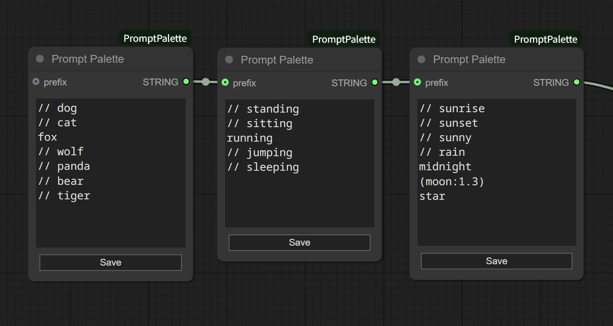

# ComfyUI PromptPalette

A custom node for ComfyUI that makes prompt editing easier by allowing phrase switching with just mouse operations

## Features

- **Toggle phrases** with checkboxes
- **Adjust phrase weights** using +/- buttons
- **Prefix input** to combine with generated text
- **Output** as properly formatted, comma-separated text

## Installation

1. Clone into the `custom_nodes` directory of ComfyUI
2. Restart ComfyUI

## Usage

1. **Add the node**: Add the `Prompt Palette` node to your workflow
2. **Edit text**:
   - Click the **Edit** button to switch to edit mode
   - Enter one phrase per line
     
   - Click the **Save** button to complete editing
3. **Control phrases**:
   - **Toggle checkboxes** in display mode to enable/disable phrases
   - **Adjust phrase weights** using +/- buttons
4. **Output**:
   - Selected phrases are output as comma-separated prompt text
     
